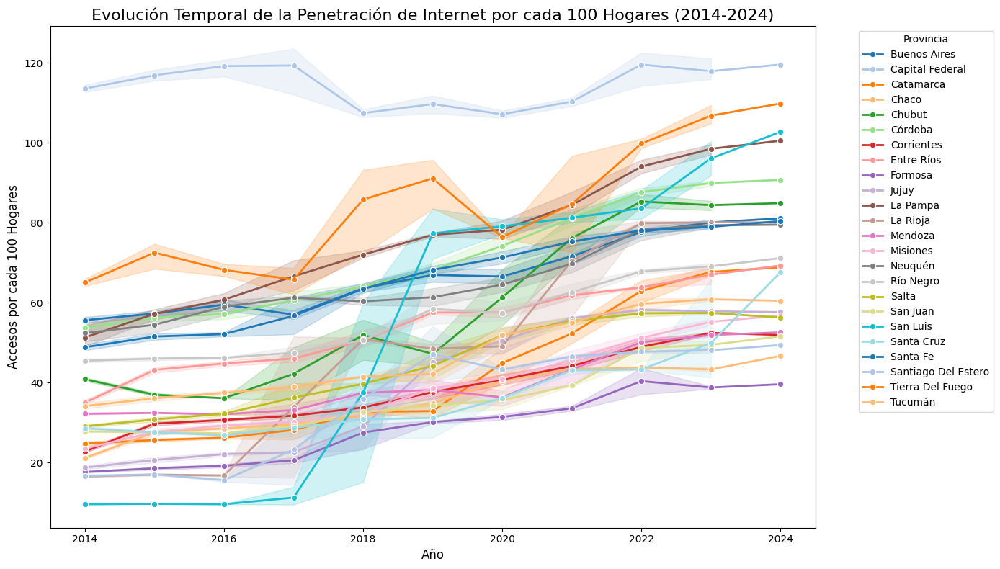

## Data Analyst - Análisis Telecomunicaciones

Nuestro rol se centra en asesorar a una empresa prestadora de servicios de telecomunicaciones con el fin de **orientar a la misma para poder brindar una buena calidad de sus servicios, identificar oportunidades de crecimiento y plantear soluciones personalizadas a sus posibles clientes**. La principal actividad de esta empresa es brindar acceso a internet, pero también se debe considerar el comportamiento del resto de los servicios de comunicación, en consecuencia, se realizará un análisis que permita reconocer el comportamiento del sector a nivel nacional.  

--- 
#### Descripción del Proyecto
El análisis abarca varios aspectos clave, incluyendo:
- Distribución Geográfica: Evaluación de la disponibilidad de diferentes tipos de conexiones (ADSL, Wireless, Fibra Óptica, Cablemodem.) y sus velocidades en las provincias.
- Tendencias Temporales: Análisis de la evolución de las conexiones a internet a lo largo de los años identificando patrones.
- Penetración del Servicio: Estudio de la penetración de internet en hogares y el acceso por tipo de tecnología.
- Visualización de Datos: Creación de gráficos interactivos y dashboards que facilitan la interpretación de los datos y permiten una exploración más profunda.
- Evaluación de los Ingresos, comparaciones interanuales y trimestrales.

---
#### Este proyecto utiliza diversas herramientas y tecnologías para el análisis y la visualización de datos, entre ellas:
`Python`, `Pandas`, `numpy`, `openpyxl`, `scipy`, `warnings`, `Matplotlib` y `Seaborn`. Para la creación de gráficos estáticos `Power BI`, `Jupyter Notebooks`.

#### Contenido del Repositorio
- Datasets: Archivos de datos proporcionados por ENACOM (Internet y televisión).
- EDA: Código en Python para explorar,procesar y análizar los datos. Con los mismos detallados y visualizados.
- Images
- Dashboards: Dashboards creados en Power BI para la visualización interactiva de los datos.

---

### Desarrollo del Análisis de Datos en cuanto a Servicios de Internet y Televisión

#### Internet
- Relación entre Penetración y Accesos: Existe una fuerte correlación entre la penetración del servicio de internet por hogares y los accesos totales. Esto indica que en las provincias donde la penetración es mayor, los accesos a tecnologías más avanzadas (como Fibra Óptica) también tienden a aumentar. Para tener un panorama general podemos ver que en la mayoría de las provincias se encuentra un aumento importante en cuanto a la pentración de Internet, lo que sugiere que la demanda sigue creciendo.Sin embargo, en provincias como San Luis o Río Negro se observa un estancamiento o menor crecimiento en los últimos años.

Vemos una Oportunidad de Crecimiento en las provincias con menor penetración tanto en internet, las cuales representan una oportunidad clave para aumentar la cobertura. Estrategias específicas, como la inversión en infraestructura y la oferta de promociones atractivas, pueden ayudar a captar mercados no saturados.

- Acceso por Tecnología: La mayor parte de los accesos a internet en las provincias se realizan a través de Cablemodem y Fibra óptica. Las tecnologías como ADSL, Wireless y Otros tienen una menor adopción, lo cual sugiere que aún existe un margen de crecimiento en tecnologías inalámbricas. 
Lo importante en este análisis es tener en cuenta que, hay una Infraestructura desigual, ya que Provincias como Formosa, Jujuy, La Pampa, y Tierra del Fuego tienen niveles mucho más bajos de accesos a Internet en general, lo que indica una infraestructura menos desarrollada. En consecuencia, dependen más de tecnologías como el ADSL, que es una tecnología más antigua. Por otro lado, provincias como Chaco y Córdoba, también están adoptando fibra óptica, pero en menor proporción. Esto sugiere que la expansión de esta tecnología está en curso, pero es desigual en todo el país.

En 2014, el ADSL y el Cablemodem dominaban la mayor parte de los accesos a internet. Para 2024, la Fibra Óptica ha ganado una presencia mucho más significativa. Aunque Cablemodem sigue siendo importante, la empresa debería considerar invertir más en la expansión de la Fibra Óptica, ya que se ha vuelto una tecnología dominante, y seguir desarrollando la infraestructura en provincias con menor penetración tecnológica.
Aun así, la cantidad de accesos totales sigue concentrada en provincias más pobladas como Buenos Aires, Capital Federal y Córdoba, lo que sugiere que estas áreas continúan siendo prioritarias en términos de acceso tecnológico avanzado.
Se recomienda invertir en Infraestructura, priorizando la expansión de Fibra Óptica y Cablemodem en áreas con baja penetración, como Santiago del Estero, Formosa y La Rioja, para cerrar la brecha digital en el acceso a internet de alta velocidad. La modernización de redes en estas áreas puede reducir la dependencia de tecnologías obsoletas y mejorar la experiencia del cliente.

- Accesos por Velocidad: Nos encontramos con una desigualdad en el Acceso a Internet, Buenos Aires y Capital Federal dominan de manera abrumadora en términos de accesos a internet en todas las velocidades, especialmente en conexiones de más de 30 Mbps. En contraste, provincias como Santiago del Estero, Chaco, La Rioja, Formosa y otras tienen una presencia muy limitada en accesos de alta velocidad, lo cual indica una gran disparidad en la infraestructura de internet entre provincias. Por lo que sería ideal disminuir la Dependencia en Conexiones Lentas, aunque la tendencia general es hacia velocidades más altas, todavía hay una dependencia significativa de las conexiones lentas (hasta 512 kbps) en algunas provincias. Esto podría indicar que ciertas regiones aún dependen de tecnologías antiguas como ADSL o conexiones de baja calidad. Se recomienda comenzar un proceso de transición y modernización de las redes en estas áreas para reducir la brecha digital y mejorar la experiencia del usuario.

La empresa podría enfocarse en mejorar la infraestructura en provincias como Catamarca, Santiago del Estero, Formosa, y La Rioja, donde la penetración de internet de alta velocidad es baja. Estas provincias podrían representar una oportunidad de crecimiento para la compañía si se invierte en aumentar la capacidad de acceso a velocidades más altas. aunque Buenos Aires es la provincia más desarrollada en términos de conectividad, también tiene una gran cantidad de conexiones lentas que podrían mejorarse. Es una oportunidad para actualizar la infraestructura y mejorar el servicio.
Santa Fe, Córdoba y Capital Federal, también muestran una cantidad significativa de accesos en velocidades lentas, Las mismas deberían estar en el radar para futuras actualizaciones de la red, presentar oportunidad para mejorar la calidad del servicio.
Las provincias como Entre Ríos, Tucumán, La Pampa, Corrientes, Salta, y Misiones tienen un menor número de accesos en velocidades lentas, pero aún están presentes. Las provincias más pequeñas o menos desarrolladas también deberían ser parte de una estrategia de mejora, ya que reducir las conexiones lentas puede generar una mayor adopción de servicios de mayor velocidad.

Capital Federal y Buenos Aires destacan, Capital Federal tiene una __penetración muy alta de internet por hogar (alrededor de 100 accesos por cada 100 hogares)__, aunque parece haber espacio para incrementar los accesos totales. - Santa Fe y Córdoba, están en una zona intermedia en términos de total de accesos. Sin embargo, su penetración de internet por hogares es relativamente baja.  Una estrategia podría ser aumentar la infraestructura en estas áreas para mejorar la penetración y aprovechar su tamaño poblacional.
Provincias como Santiago del Estero, Salta, San Juan, Formosa y La Rioja __muestran tanto baja penetración de internet por hogar (menos de 50 accesos por cada 100 hogares) como bajo total de accesos__. Esto indica que son regiones que podrían estar experimentando una menor cobertura o capacidad de infraestructura. La empresa debería enfocar sus esfuerzos en mejorar la infraestructura de telecomunicaciones, ya que tanto la penetración por hogar como los accesos totales son bajos.
La Pampa y Tierra del Fuego muestran una __penetración relativamente buena (cerca de 80 accesos por cada 100 hogares), pero sus totales de acceso son muy bajos.__ Para éstas, la empresa podría considerar estrategias de expansión de mercado, ya que aunque la penetración es buena, el número total de accesos sigue siendo bajo. Una posible estrategia es promover el uso de servicios de internet en estas regiones menos pobladas.

- Evolución Temporal de la Banda Ancha Fija: Se ha observado un crecimiento sostenido en el acceso a Banda Ancha Fija en la mayoría de las provincias desde 2014, con Buenos Aires y Capital Federal liderando. Sin embargo, provincias como Chaco, Santiago del Estero y Formosa presentan un crecimiento más lento.  Desde 2014, la cantidad de accesos a Banda Ancha Fija ha tenido un crecimiento constante hasta 2023. La adopción de Banda Ancha Fija ha sido dominante y ha mostrado un crecimiento sostenido en la última década, mientras que Dial-up está prácticamente obsoleto. Por lo que la empresa debería priorizar las inversiones en infraestructura de Banda Ancha Fija y descontinuar el soporte para Dial-up.

Aun así, 

Buenos Aires y Capital Federal destacan como las provincias con el mayor número de conexiones Dial-up. Estas son, de lejos, las que más conexiones Dial-up mantienen, lo que podría deberse a la alta densidad de población y la presencia de áreas donde la infraestructura de banda ancha no ha sido implementada o donde el acceso a tecnologías más avanzadas es limitado.
Provincias como Neuquén, Mendoza, Río Negro, y San Juan aún tienen un número significativo de conexiones Dial-up, lo que sugiere que existen áreas donde la transición hacia tecnologías de banda ancha más modernas no ha sido completa.
Este gráfico evidencia la necesidad de una actualización tecnológica en las provincias con un alto uso de Dial-up, especialmente en Buenos Aires y Capital Federal, para reducir esta dependencia de tecnologías obsoletas.
Las empresas de telecomunicaciones podrían enfocarse en áreas específicas donde aún persisten estas conexiones, ya que representan oportunidades claras para implementar soluciones de banda ancha fija o móvil.

- Ingresos por Trimestre: Los ingresos del servicio de internet han mostrado un crecimiento continuo, con aumentos significativos en los trimestres finales de cada año, lo cual podría sugerir estacionalidad.
Televisión

Se ha identificado una tendencia de crecimiento en los ingresos durante los últimos trimestres del año, lo cual sugiere la necesidad de una planificación estacional adecuada para maximizar los ingresos. La empresa puede capitalizar en este comportamiento aumentando la promoción y las ofertas durante los meses de mayor demanda.

### Análisis de televisión
- Accesos por Provincia: Provincias como Buenos Aires y Capital Federal dominan los accesos a televisión por suscripción, mientras que otras provincias, como Chaco y Tierra del Fuego, presentan menor penetración y accesos. Esto sugiere que existen oportunidades para mejorar la oferta en estas zonas. La mayoría de las provincias muestran un crecimiento estable o ligeramente ascendente, sin grandes picos o caídas bruscas, lo que podría indicar una penetración ya establecida en estos mercados.

- Penetración por Hogares: La penetración de la televisión por suscripción es mayor en provincias con mayor densidad de población, como Buenos Aires y Capital Federal. Sin embargo, provincias más pequeñas presentan una penetración mucho menor, lo que podría ser un área clave para aumentar la penetración del servicio.

Se destaca una variabilidad Regional en la penetración entre provincias. Por ejemplo, Tierra del Fuego tiene una alta penetración con valores más concentrados, mientras que provincias como Formosa y Santiago del Estero tienen penetraciones más bajas y dispersas. Por otro lado, hay otras con Mayor Penetración como Capital Federal, Santa Fe, y Tierra del Fuego que muestran una alta penetración, lo que sugiere que ya tienen una infraestructura sólida en televisión por suscripción.
Vemos oportunidades de Crecimiento en Provincias como Santiago del Estero, San Luis, y La Pampa que presentan menor penetración, lo que indica áreas de posible expansión y mejora en el servicio de TV por suscripción. Por lo que ña empresa debería enfocar sus esfuerzos en mejorar la penetración en provincias con valores bajos, mientras mantiene la calidad en provincias con alta penetración. Esto permitirá una mayor equidad en el acceso a sus servicios y un crecimiento sostenido en mercados menos saturados.

- Evolución de los Ingresos por TV: Los ingresos por televisión han crecido considerablemente desde 2014, con un salto notable a partir de 2022. La televisión satelital, si bien ha mantenido una participación más baja, sigue representando una parte significativa de los ingresos. Hay un crecimiento constante, esto sugiere una tendencia positiva y sostenida en las suscripciones de TV durante el año. Un aumento notable en el cuarto trimestre, lo que podría deberse a diferentes factores, como promociones estacionales, mayor demanda de suscripciones durante el fin de año o lanzamientos de contenido atractivo que generaron más suscripciones.  Se considera una posible oportunidad de expansión a este comportamiento creciente que sugiere que la empresa está en un buen momento para continuar expandiéndose o invirtiendo en estrategias que mantengan o aumenten este ritmo de crecimiento. Los datos sugieren que las suscripciones continúan siendo una fuente de ingresos sólida y en expansión.

En general, los datos sugieren que la empresa tiene una fuerte presencia en las principales provincias, pero existen oportunidades para expandir en mercados con menos penetración tecnológica. La inversión en infraestructura, junto con una estrategia de marketing sólida, puede ayudar a la empresa a seguir creciendo en un mercado altamente competitivo.

### Fuente:
Los datos fueron obtenidos de la página del Ente Nacional de Comunicaciones (ENACOM), organismo regulador de las telecomunicaciones en Argentina.
https://indicadores.enacom.gob.ar/datos-abiertos

